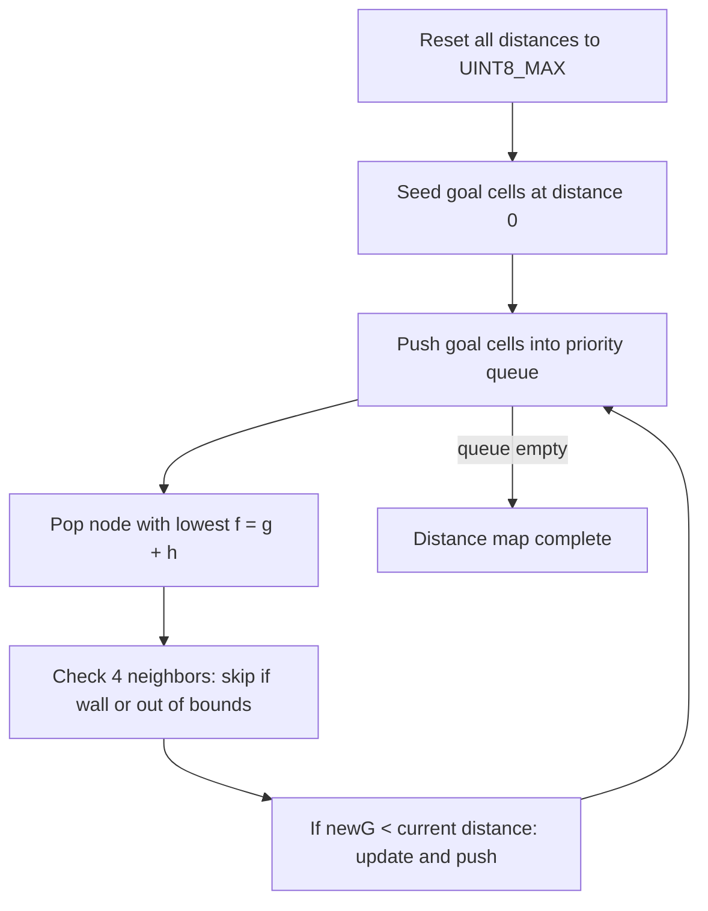
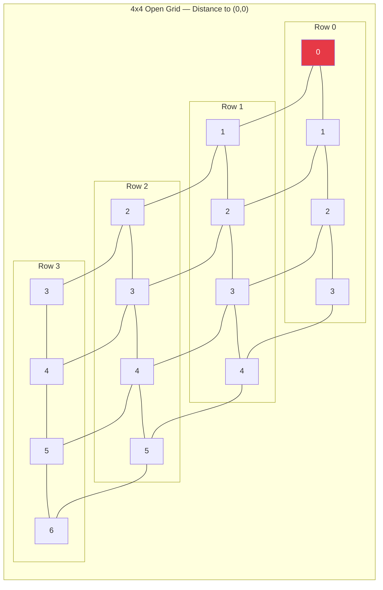

[Home](../index.md) › [Algorithms](index.md) › **A\*-Style Distance Map**

# A\*-Style Distance Map (`updateDistancesAStar`)

## What It Computes

A gradient field over the maze: every cell stores its estimated cost-to-target as a single byte:

```cpp
uint8_t distance[MAZE_WIDTH][MAZE_LENGTH];
```

Unreachable cells carry the sentinel `UINT8_MAX` (see [RD-27](../rd-items/navigation/rd-27-distance-sentinel-collision.md)); goal cells sit at `0`.

## Heuristic Seeding

`heuristic(row, col, returning, api)` provides the initial estimate — Manhattan-style distance from a cell to the current target:

- Outbound exploration: distance to the goal region.
- `returning == true`: distance to the start cell instead. The same machinery serves both legs; only the target changes (though the return leg is never activated today — [RD-11](../rd-items/navigation/rd-11-return-phase-unimplemented.md)).

## Compute Steps



## Relaxation to Fixpoint

`updateDistancesAStar(returning, api)` then iterates over cells, relaxing each cell's distance against its open neighbors until nothing changes:

```text
repeat until stable:
    for each cell (r, c):
        best = min(distance[open neighbors of (r,c)]) + step_cost
        if best < distance[r][c]: distance[r][c] = best
```

Walls gate neighbor lookup through the North/East arrays ([Wall Encoding](../design-decisions/wall-encoding.md)), so blocked edges never propagate cost. Because it recomputes globally rather than incrementally, each call reflects *all* walls known at that moment — this is what lets the greedy follower in [Movement Primitives](movement-primitives.md) escape dead ends without any explicit path memory.

## Example: Distance Gradient

A 4x4 open grid (no walls) with the goal at `(0, 0)`. Each cell shows its distance value:



Walls block propagation, so the gradient reshapes around discovered obstacles after each recompute.

## The Gradient Realized: Shortest Path

On the [example maze](../overview/index.md#the-arena) from the Overview, the final distance map yields this shortest start→goal path — **96 cell moves**, marked `*`:

```text
┌─────┬─────────┬───────┬───────┐
│  * *│    * * *│       │       │
├── │ │ ┌── ┌─┐ └─┐ ┌── │ ────┐ │
│* *│*│ │* *│ │* *│ │   │     │ │
│ ┌─┘ └─┤ ┌─┘ └── │ └─┐ └─┬───┘ │
│*│  * *│*│* * * *│   │   │     │
│ └─┬─┐ │ │ ──┬───┴── ├─┐ │ ──┐ │
│* *│ │* *│* *│       │ │ │   │ │
│ │ │ ├───┴── ├── ┌───┘ │ │ │ │ │
│ │*│ │* * * *│   │     │ │ │ │ │
│ │ │ │ ┌─┬───┘ ┌─┴───┐ │ └─┤ │ │
│ │*│* *│ │     │     │ │   │ │ │
│ │ │ ──┤ │ │ ──┤ ┌── │ └─┐ │ └─┤
│ │*│* *│   │   │ │       │ │   │
│ │ ├─┐ │ ──┴─┐ │ ├───────┤ │ │ │
│ │*│ │*│     │G│G│       │ │ │ │
├─┘ │ │ ├───┐ │ │ │ ┌───┐ │ └─┘ │
│* *│ │*│   │ │G│G  │* *│       │
│ ┌─┘ │ └─┐ │ │ ├───┘ │ └───┬─┐ │
│*│   │* *│   │*│* * *│* * *│ │ │
│ └─┐ └─┐ └───┤ │ ┌───┼───┐ │ │ │
│* *│   │* * *│*│*│   │* *│*│ │ │
│ │ ├── ├───┐ │ │ │ │ │ │ │ │ │ │
│ │*│   │   │*│* *  │ │*│* *│ │ │
│ │ │ ──┤ │ │ └─┬───┘ │ ├───┘ │ │
│ │*│   │ │ │* *│     │*│     │ │
├─┘ ├── │ │ └─┐ ├───┐ │ └───┐ │ │
│* *│   │ │   │*│* *│ │* * *│ │ │
│ ┌─┘ ┌─┘ │ ┌─┘ │ │ └─┴──── │ │ │
│*│   │   │ │* *│*│* * * * *│ │ │
│ │ │ │ ──┤ │ ──┘ ├─────────┘ │ │
│S│ │     │  * * *│             │
└─┴─┴─────┴───────┴─────────────┘
```

Compare that with the explorer's trail in [Maze Exploration](maze-exploration.md#worked-example-one-run-seen-from-inside): the solved path reuses only a fraction of the ground the explorer covered. No route list is stored anywhere — the gradient *is* the path; each cell simply points downhill toward a goal cell. In competition terms, this is the line the speed-run phase would sprint ([Mission Phases](../overview/index.md#mission-phases)).

## Complexity Trade-Off

A full relaxation sweep per discovery is O(cells²) worst-case but trivially cheap at 256 cells — the right trade-off for an MCU, and far simpler than incremental replanning. The remaining inefficiency is *when* it runs: currently on almost every cell regardless of new information ([RD-26](../rd-items/navigation/rd-26-redundant-wall-readings.md)).

---

| ← Previous | Up | Next → |
|---|---|---|
| [Maze Exploration Loop](maze-exploration.md) | [Algorithms](index.md) | [Movement Primitives](movement-primitives.md) |
