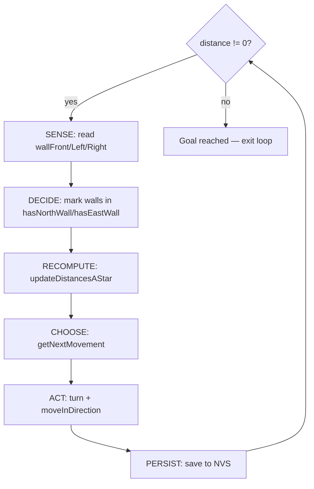

[Home](../index.md) › [Algorithms](index.md) › **Maze Exploration Loop**

# Maze Exploration Loop (`floodFill`)

## The Cycle

`floodFill(API api)` (`algorithm.cpp`) runs until the mouse stands on a goal cell:



## Properties

- **Greedy descent**: step 4 picks an improving neighbor of the current cell rather than following a precomputed path — cheap and reactive.
- **Global recompute on discovery**: any newly sensed wall triggers a full distance-map refresh, so dead ends are abandoned automatically as the gradient reroutes.
- **Goal test by gradient**: arriving where `distance == 0` means a goal cell is reached; no goal coordinates are needed in the loop itself.

## Reserved but Unused: the Return Trip

A `returning` flag threads through the heuristic and neighbor logic so the same machinery could target the start cell for the trip home. It is hardcoded `false` and never flipped — after reaching the goal the loop simply exits, stranding the mouse at the far end of the maze ([RD-11](../rd-items/navigation/rd-11-return-phase-unimplemented.md)).

## Robustness Gaps

- No iteration cap: a trapped or desynced state loops forever ([RD-17](../rd-items/navigation/rd-17-unbounded-search-loop.md)).
- `getNextMovement` can fall back to NORTH with no bounds check when no neighbor improves ([RD-05](../rd-items/navigation/rd-05-fallback-move-north-oob.md)).
- Wall sensors are polled twice per cell and recompute fires even for already-known walls ([RD-26](../rd-items/navigation/rd-26-redundant-wall-readings.md)).

## Worked Example: One Run, Seen From Inside

The same generated example maze shown whole on the [Overview](../overview/index.md) page, but now through the robot's eyes partway into exploration. `*` = visited cells, `@` = current pose, `?` = goal cells not yet seen. **Lines are drawn only where walls have been sensed** — blank regions are unknown territory:

```text
┌─────┬─────────┬───────────────┐
│* * *│* * * * *│               │
├── │ │ ┌── ┌─┐ └─┐             │
│* *│*│*│* *│ │* *│             │
│ ┌─┘ └─┤ ┌─┘ └── │             │
│*│  * *│*│* * * *│             │
│ └─┬─┐ │ │ ──┬───┘             │
│* *│ │* *│* *│                 │
│ │ │ ├───┴── │                 │
│*│*│ │* * * *│                 │
│ │ │ │ ┌─────┘                 │
│*│*│* *│                       │
│ │ │ ──┤                       │
│*│*│* *│                       │
│ │ ├─┐ │                       │
│*│*│ │*│      ? ?              │
├─┘ │ │ │           ┌───┐       │
│* *│ │*│      ? ?  │* *│       │
│ ┌─┘ │ └─┐     ┌───┘ │ └───┐   │
│*│   │* *│    *│* * *│* * *│   │
│ └─┐ └─┐ └───┐ │ ┌───┼───┐ │   │
│* *│   │* * *│*│*│* *│* *│*│   │
│ │ │   └───┐ │ │ │ │ │ │ │ │   │
│*│*│       │*│* * *│*│*│* *│   │
│ │ │       │ └─┬───┘ │ ├───┘   │
│*│*│       │* *│* @ *│*│       │
├─┘ │       └─┐ ├───┐ │ └───┐   │
│* *│         │*│* *│*│* * *│   │
│ ┌─┘       ┌─┘ │ │ └─┴──── │   │
│*│         │* *│*│* * * * *│   │
│ │         │ ──┘ ├─────────┘   │
│S│          * * *│             │
└─┴───────────────┴─────────────┘
```

After 115 of 256 cells visited, most of the map is still unknown — and the trail shows deliberate wandering: dead ends entered, backtracked, recorded so the gradient never sends the mouse there again. That is exploration working as designed; the inefficiency is the price of partial observability.

### Robot State Along the Way

A direct slice of the sense→decide→act stream driving the loop above. Each step reads three relative sensors, decides an action, updates the pose:

| Step | Pose `(row,col)` | Facing | Sensors (L / F / R) | Decision | Resulting pose |
|---|---|---|---|---|---|
| 1 | `(0,0)` | N | wall / open / wall | FORWARD | `(1,0)` facing N |
| 3 | `(2,0)` | N | wall / **wall** / open | TURN_RIGHT | `(2,1)` facing E |
| 4 | `(2,1)` | E | open / **wall** / wall | TURN_LEFT | `(3,1)` facing N |
| 10 | `(3,0)` | S | wall / wall / wall | BACKTRACK (turn right, retreat) | `(4,0)` facing W |
| 67 | `(10,2)` | W | open / wall / open | TURN_LEFT (prefers unvisited) | `(9,2)` facing S |
| 132 | `(6,7)` | N | wall / open / wall | FORWARD | `(7,7)` facing N — **goal reached** |

- **Steps 3–4**: front blocked → rotate toward an open side before moving ([Movement Primitives](movement-primitives.md)).
- **Step 10**: walls on all three sides — backtrack to the last junction; the map keeps the dead end.
- **Step 67**: both sides open — [distance-map](astar-distance-map.md) descent picks, not luck.
- **Step 132**: `distance == 0` under the robot — exactly the loop's exit condition.

---

| ← Previous | Up | Next → |
|---|---|---|
| [Algorithms](index.md) | [Algorithms](index.md) | [A\*-Style Distance Map](astar-distance-map.md) |
