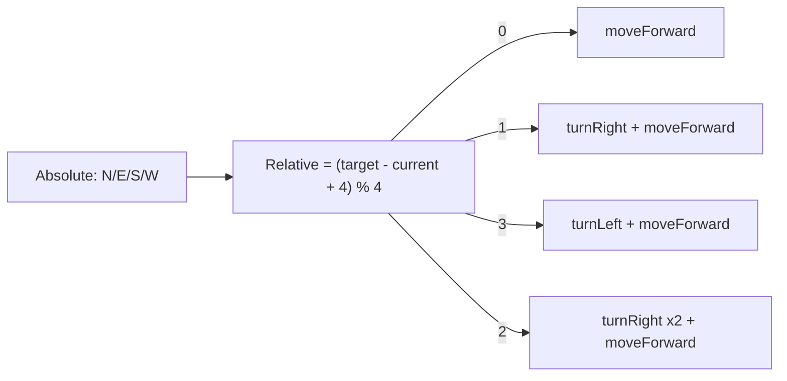

[Home](../index.md) › [Algorithms](index.md) › **Movement Primitives**

# Movement Primitives

## Coordinate Convention

Everything here operates on `(row, col)` cells where **row 0 is the south edge and column 0 is the west edge** — NORTH increments `row`, EAST increments `col`. The start pose `(0,0)` faces NORTH, i.e. toward the center of the maze. The perimeter exists as physical walls but not as stored wall entries; out-of-bounds moves are rejected by bounds checks (`0 <= index < MAZE_LENGTH`) inside the neighbor logic.

## Neighbor Choice: `getNextMovement`

Given the current cell, scans all four absolute directions and returns the one whose neighbor has the smallest `distance` value — pure greedy descent on the [distance map](astar-distance-map.md):

- A neighbor qualifies only if it is in bounds **and** no wall blocks the edge (checked against the North/East arrays per [Wall Encoding](../design-decisions/wall-encoding.md)).
- The comparison uses `<=`, so equal-distance sideways steps are allowed.
- Defect: if no neighbor improves on the current cell's own value, the function silently falls back to NORTH without any bounds or wall check — the solver can then walk off the array or into a wall ([RD-05](../rd-items/navigation/rd-05-fallback-move-north-oob.md), top-priority algorithm fix).

## Absolute → Relative Translation: `moveInDirection`

```text
relative = (target - currentDirection + 4) % 4
   0 -> moveForward()
   1 -> turn right, then move
   3 -> turn left,  then move
   2 -> about-face (two turns), then move
```

After moving, the pose globals (`currentRow`/`currentCol`/`currentDirection`) advance by the absolute direction taken.

## Direction Mapping



## Turning: `turn(Direction target, API api)`

Computes the signed shortest rotation between `currentDirection` and the target using the same modular arithmetic: delta 1 → +90°, delta 3 → −90°, delta 2 → 180°, delta 0 → no-op. It delegates the physical rotation to the hardware adapter (`api.turnRight/turnLeft()` in simulation; `Robot::turn()` on hardware, see [PID Motion Control](pid-motion-control.md)).

## Wall Queries: `isWallInDirection`

Maps an absolute direction onto the adapter's relative sensors (`wallFront/wallLeft/wallRight`) using `(currentDirection + offset) % 4`. The rear case has no direct sensor and currently answers `false` from stale data assumptions ([RD-10](../rd-items/navigation/rd-10-rear-wall-assumption.md)).

---

| ← Previous | Up | Next → |
|---|---|---|
| [A\*-Style Distance Map](astar-distance-map.md) | [Algorithms](index.md) | [PID Motion Control](pid-motion-control.md) |
