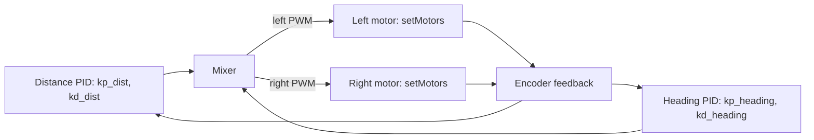
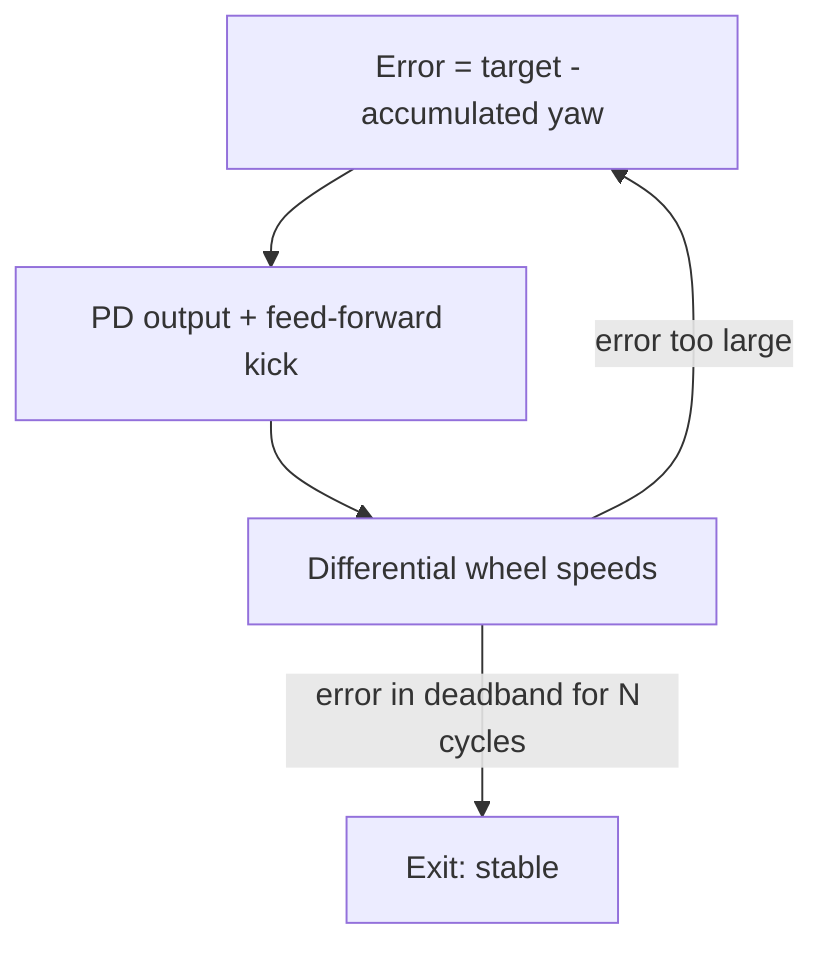

[Home](../index.md) › [Algorithms](index.md) › **PID Motion Control**

# PID Motion Control (`Robot.cpp`)

## Straight-Line Motion: `move(int cells)`

Closed-loop over encoder odometry:

1. Reset both encoder counters; compute target traveled distance for `cells` cells.
2. Ramp `baseSpeed` up toward `MAX_SPEED_FORWARD ≈ 65` PWM.
3. Two PID terms mix into the wheels:
   - **Distance term** (`kp_dist`, `kd_dist` on remaining cm) drives both wheels forward.
   - **Heading term** (`kp_heading`, `kd_heading` on IMU yaw error) differentially trims the wheels to hold a straight line.
4. Exit conditions: distance reached, or center ToF `< 40 mm` (obstruction emergency stop — note a stale zero reading also triggers it, [RD-12](../rd-items/sensing/rd-12-zero-distance-read-as-wall.md)).

Known defect: the heading correction is currently multiplied by zero, so straight-line drift correction is inert — top-priority fix [RD-01](../rd-items/control/rd-01-heading-correction-disabled.md). The integer `pidSignal` also truncates fractional PID output ([RD-08](../rd-items/control/rd-08-pid-signal-truncation.md)).

## Move Cascade

## Turning: `turn(int targetDegrees)`

Relative-yaw closed loop against the IMU:

- Error = signed difference between accumulated and target angle.
- PD output plus a constant feed-forward kick drives the differential wheel speeds; exit requires the error inside a deadband for `stableCount` consecutive cycles.
- Defect: the ±15 feed-forward applies unconditionally for right turns even inside the deadband, overriding settle logic and biasing left/right turns asymmetrically ([RD-02](../rd-items/control/rd-02-turn-feedforward-prevents-settling.md)).

## Turn Loop

## Heading Snap: `snapToCardinal()`

After motion, yaw is pulled to the nearest multiple of 90° with the same PD structure, removing accumulated turn error before the next cell.

## Background Refresh

A FreeRTOS task pinned to the second core should keep sensor caches fresh between moves; today it polls `getRoll()` instead of pumping the IMU queue ([RD-03](../rd-items/sensing/rd-03-imu-background-refresh-skipped.md)) and busy-waits with `vTaskDelay(0)` ([RD-16](../rd-items/control/rd-16-busy-wait-sensor-task.md)).

---

| ← Previous | Up | Next → |
|---|---|---|
| [Movement Primitives](movement-primitives.md) | [Algorithms](index.md) | [R&D Items](../rd-items/index.md) |
