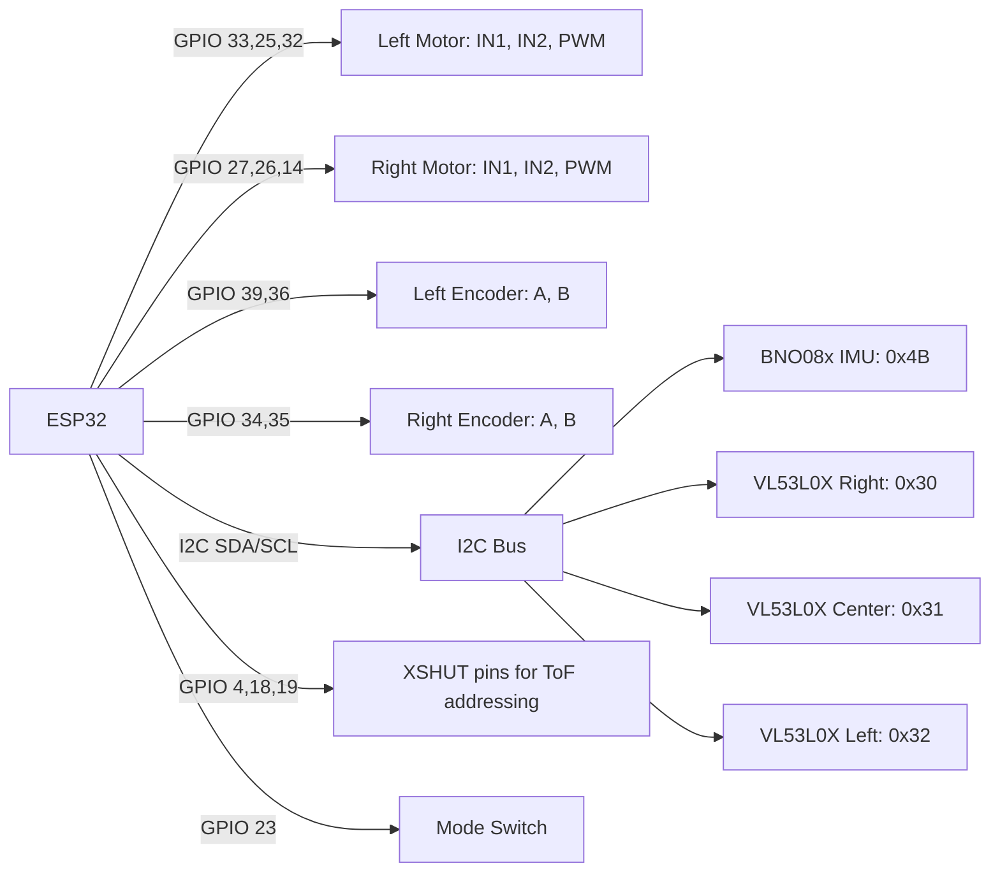

[Home](../index.md) › [Architecture](index.md) › **Hardware Platform**

# Hardware Platform

## Microcontroller

ESP32 (Arduino framework). The firmware uses FreeRTOS primitives directly: `xTaskCreatePinnedToCore` for the sensor task, semaphore handles in `IMU`/`TOF`, and `portMUX_TYPE` spinlocks in the encoder ISRs.

## Pin Map

Defined in `motor.h:7-17` and `micromouse.ino:78`.

| GPIO | Signal | Direction | Notes |
|---|---|---|---|
| 39 | `ENCAL` — Left encoder A | Input | Yellow wire, interrupt on RISING |
| 36 | `ENCBL` — Left encoder B | Input | White wire, sampled in ISR |
| 34 | `ENCAR` — Right encoder A | Input | Interrupt on RISING |
| 35 | `ENCBR` — Right encoder B | Input | Sampled in ISR |
| 33 | `IN1L` — Left motor IN1 | Output | H-bridge direction |
| 25 | `IN2L` — Left motor IN2 | Output | H-bridge direction |
| 32 | `speedL` — Left PWM | Output | `analogWrite`, left side trimmed ×0.98 |
| 27 | `IN1R` — Right motor IN1 | Output | H-bridge direction |
| 26 | `IN2R` — Right motor IN2 | Output | H-bridge direction |
| 14 | `speedR` — Right PWM | Output | `analogWrite` |
| 23 | `solveSwitch` | Input, pull-up | Load saved maze at boot |
| 2 | Status LED | Output | Referenced in commented sketch |

GPIO 34-39 are input-only pins on the ESP32, which suits them for encoder feedback.

## I2C Bus

Shared `Wire` bus for:

- **BNO08x IMU** via `Adafruit_BNO08x` (orientation reports)
- **3× VL53L0X ToF sensors** via `Adafruit_VL53L0X`; all three share one address at reset and are re-addressed during `TOF::setID()` using dedicated XSHUT lines.

## Pin and Bus Topology

## Odometry Constants

From `motor.cpp:6-7`:

- `TICKS_PER_REV = 60` encoder ticks per wheel revolution
- `WHEEL_DIA = 4` (cm) — used by `getDistanceL/R()` as `(ticks / 60) * π * 4`

## Related R&D Items

- [RD-15](../rd-items/reliability/rd-15-hang-on-init-failure.md) — sensor init failures hang the boot sequence
- [RD-29](../rd-items/control/rd-29-hardcoded-motor-trim.md) — undocumented left-PWM trim constant

---

| ← Previous | Up | Next → |
|---|---|---|
| [System Overview](system-overview.md) | [Architecture](index.md) | [Sensor Suite](sensor-suite.md) |
