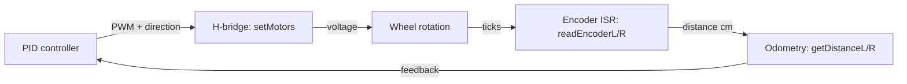

[Home](../index.md) › [Architecture](index.md) › **Motor Drive**

# Motor Drive

## Outputs

`MotorDriver::setMotors(int16_t leftSpeed, int16_t rightSpeed)` (`motor.cpp:90-111`) drives two H-bridge channels:

- Sign selects direction by driving one of `IN1x`/`IN2x` high (`setDirection`); zero coasts both low.
- Magnitude becomes PWM duty via `analogWrite` on `speedL`/`speedR`.
- The left channel applies a fixed `×0.98` trim to compensate motor imbalance — see [RD-29](../rd-items/control/rd-29-hardcoded-motor-trim.md).

Closed-loop consumers cap commands near `MAX_SPEED_FORWARD ≈ 65` (8-bit PWM scale) in normal driving.

## Odometry

Quadrature encoders feed four GPIO inputs. Channel-A edges trigger `IRAM_ATTR` ISRs (`readEncoderL/R`, `motor.cpp:11-26`) that increment/decrement static volatile counters `posi`/`posiR` based on channel-B phase — giving signed tick counts per wheel.

Thread safety: counters are read and cleared inside `portENTER_CRITICAL`/`portEXIT_CRITICAL` sections using per-wheel `portMUX_TYPE` locks (`getPosL/R`, `resetEncoderL/R`).

Distance conversion (`motor.cpp:65-70`):

```cpp
distance_cm = (ticks / TICKS_PER_REV) * (PI * WHEEL_DIA)   // 60 ticks/rev, 4 cm dia
```

`resetEncoderL/R()` zero the counters before closed-loop moves so `Robot::move()` can integrate traveled centimeters.

## Consumers

- `Robot::move()` — distance PID on remaining cm plus heading-hold term
- `Robot::turn()` — yaw PID toward a relative degree target
- `Robot::calibrateDriftFactor()` — open-loop comparison of left/right odometry

## Command Chain: PID to Wheel to Encoder



---

| ← Previous | Up | Next → |
|---|---|---|
| [Sensor Suite](sensor-suite.md) | [Architecture](index.md) | [Simulator Interface](simulator-interface.md) |
