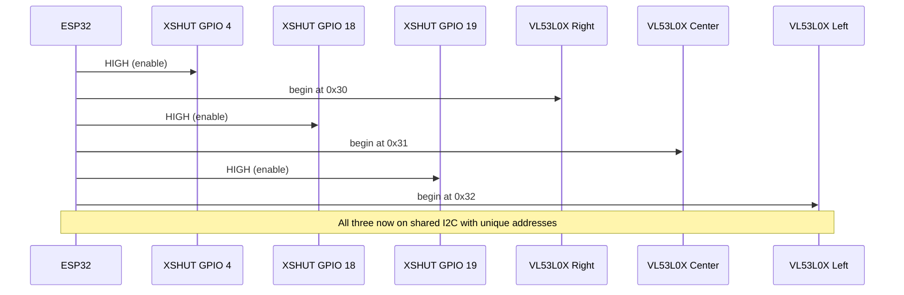
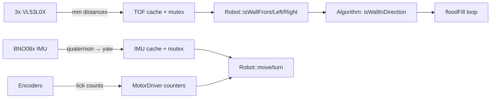

[Home](../index.md) › [Architecture](index.md) › **Sensor Suite**

# Sensor Suite

## Time-of-Flight Ranging (`Tof.h/.cpp`)

Three `Adafruit_VL53L0X` rangefinders provide millimeter distances:

| Object | Semantic position | Accessor |
|---|---|---|
| `lox1` | Right | `getTofRight()` |
| `lox2` | Center | `getTofCenter()` |
| `lox3` | Left | `getTofLeft()` |

Initialization (`begin()` → `setID()`) brings each sensor out of reset one at a time over dedicated XSHUT lines so the three identical default addresses can be reassigned on the shared I2C bus.

`updateReadings()` ranges all three sensors and caches results in `leftDistance` / `centerDistance` / `rightDistance`, each guarded by its own FreeRTOS semaphore. Readings are consumed by `Robot::isWallFront/Left/Right` against thresholds `THRESHOLD_FRONT = 70 mm` and `THRESHOLD_SIDE = 170 mm` (`Robot.h:9-10`).

Known gaps: any `RangeStatus != 4` is accepted as valid ([RD-13](../rd-items/sensing/rd-13-invalid-range-statuses.md)), and a zero-initialized cache reads as "wall ahead" before the first sample ([RD-12](../rd-items/sensing/rd-12-zero-distance-read-as-wall.md)).

## ToF Sensor Bring-Up Sequence

## Inertial Measurement (`IMU.h/.cpp`)

An `Adafruit_BNO08x` provides stabilized rotation-vector reports (`SH2_ARVR_STABILIZED_RV`).

- `update()` pumps the sensor event queue and stores `yaw/pitch/roll` under `imu_Mutex`.
- `getYaw()` takes the mutex before returning heading.
- A yaw-offset calibration averages readings over the first five seconds after boot to remove mounting bias; the result is subtracted from subsequent readings.
- `snapToCardinal()` in `Robot.cpp` closes the loop on yaw to lock heading to multiples of 90° after turns.

Consumers: `Robot::turn()` (relative angle targets) and the heading term of `Robot::move()`.

## Wall Queries (sensor → world)

`Robot::isWallFront/Left/Right` convert raw distances into booleans. The solver's `isWallInDirection` (`algorithm.cpp:149-154`) maps absolute directions (N/E/S/W) onto these relative queries based on `currentDirection`.

## Sensor to Consumer Data Flow

---

| ← Previous | Up | Next → |
|---|---|---|
| [Hardware Platform](hardware-platform.md) | [Architecture](index.md) | [Motor Drive](motor-drive.md) |
