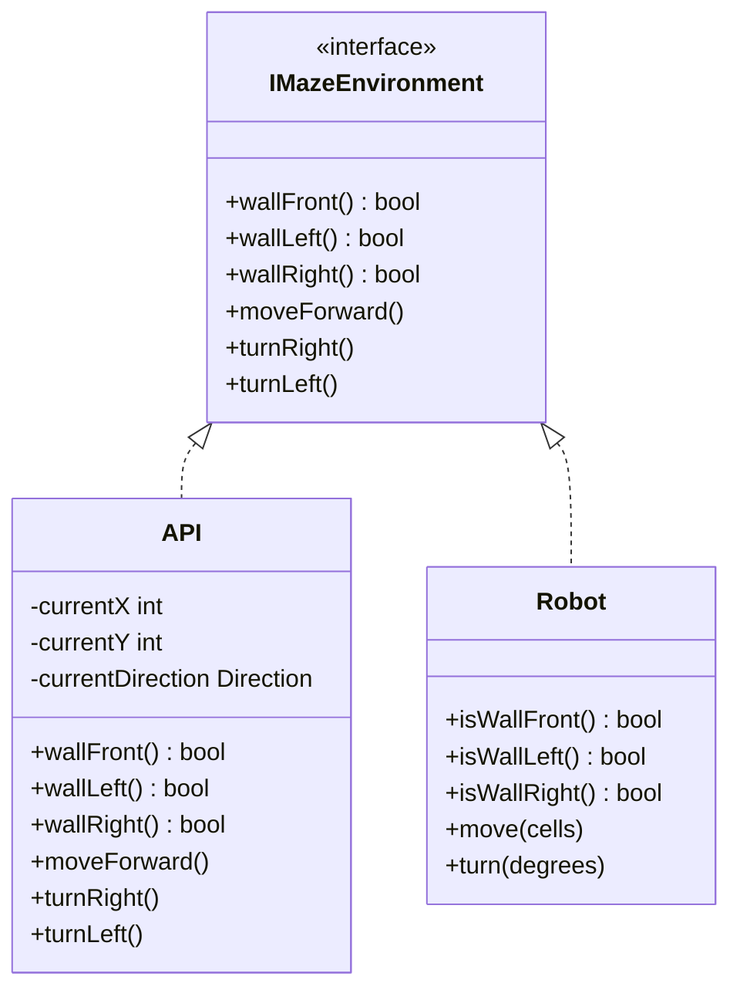

[Home](../index.md) › [Architecture](index.md) › **Simulator Interface**

# Simulator Interface (`API.h/.cpp`)

## Purpose

`API` adapts the maze-solver to its environment. Its method set follows the well-known [Micromouse Simulator](https://github.com/mackorone/mms) C++ convention, which lets `algorithm.cpp` run unmodified against a desktop simulator or be pointed at real hardware later.

## Surface

| Method | Role |
|---|---|
| `begin()` | Initialize the environment |
| `wallFront()` / `wallLeft()` / `wallRight()` | Relative wall queries used by the solver |
| `moveForward()` | Advance one cell; updates internal pose |
| `turnRight()` / `turnLeft()` | Rotate 90°; updates internal pose |
| `setColor(x, y, c)` / `setText(x, y, s)` | Visualization hooks for the simulator UI |

## Design Shape

Every member is `static`, so `API` behaves as a namespace-like singleton. Algorithm functions still declare parameters such as `floodFill(API api)` — harmless today because there is nothing to copy, but misleading; see [RD-20](../rd-items/code-health/rd-20-api-by-value-signatures.md) and [RD-18](../rd-items/code-health/rd-18-static-api-singleton.md).

## Hidden Pose State

`API` privately tracks `currentX`, `currentY`, and `currentDirection`, updating them inside `moveForward`/`turnRight`/`turnLeft`. The solver maintains its *own* parallel pose globals, so two books are kept simultaneously — see [State Management](../design-decisions/state-management.md) and [RD-14](../rd-items/navigation/rd-14-duplicate-direction-state.md).

## Adapter Relationship

## Hardware Parity

`Robot` mirrors the same query/move vocabulary (`isWallFront` ↔ `wallFront`, `move(1)` ↔ `moveForward()`), which is what makes the dual-target workflow possible without touching the solver.

---

| ← Previous | Up | Next → |
|---|---|---|
| [Motor Drive](motor-drive.md) | [Architecture](index.md) | [Design Decisions](../design-decisions/index.md) |
