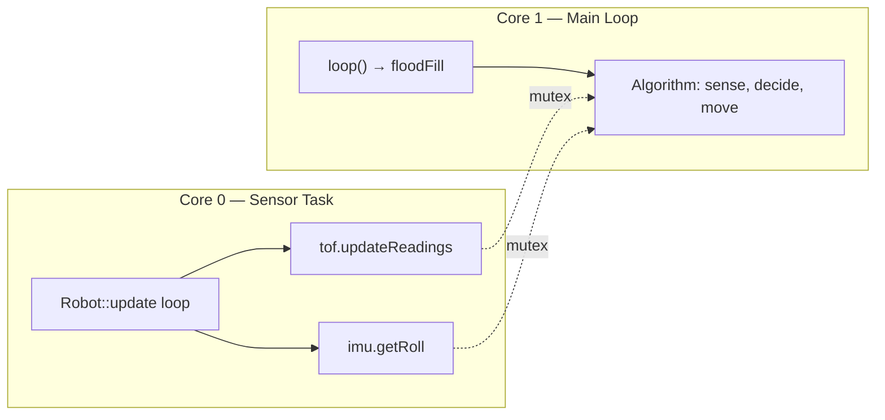

[Home](../index.md) › [Architecture](index.md) › **System Overview**

# System Overview

## Execution Model

The active entry point is `micromouse.ino`. `setup()` configures the mode switch (GPIO23, `INPUT_PULLUP`), calls `api.begin()`, and — if the switch reads HIGH — restores a previously saved maze via `loadMatrix()` from non-volatile storage. `loop()` then runs `floodFill(api)` continuously.

A second, hardware-oriented path exists in `Robot.cpp`: `Robot::begin()` initializes sensors, spawns a FreeRTOS sensor-update task pinned to the second core, and exposes motion primitives (`move`, `turn`, `snapToCardinal`). It is currently commented out of the sketch; see [Dual-Target Workflow](../design-decisions/dual-target-workflow.md).

## Components

| Component | Files | Responsibility |
|---|---|---|
| Entry point | `micromouse.ino` | Boot, mode selection, main loop |
| Maze solver | `algorithm.h/.cpp` | Wall bookkeeping, distance map, next-step selection, NVS save/load |
| Simulator adapter | `API.h/.cpp` | Static facade matching the Micromouse Simulator C++ API |
| Hardware adapter | `Robot.h/.cpp` | Sensor fusion wall queries + closed-loop motion |
| Range sensors | `Tof.h/.cpp` | Three VL53L0X ToF sensors, left/center/right distances in mm |
| Inertial sensing | `IMU.h/.cpp` | BNO08x absolute orientation, yaw/pitch/roll with mutex |
| Actuation | `motor.h/.cpp` | Dual H-bridge PWM + quadrature encoder odometry |

## Data Flow (explore step)

## Concurrency Model

- A FreeRTOS task (`Robot::update`) polls sensors in a loop, intended for the core opposite the Arduino loop task.
- The IMU guards its orientation values with a FreeRTOS mutex; the TOF class keeps per-sensor semaphores around cached distances.
- Encoder ISRs use `portMUX_TYPE` critical sections when reading/resetting tick counters (`motor.cpp:51-81`).
- The algorithm layer itself is single-threaded and runs exclusively in the `loop()` task.

## Concurrency Diagram

---

| ← Previous | Up | Next → |
|---|---|---|
| [Architecture](index.md) | [Architecture](index.md) | [Hardware Platform](hardware-platform.md) |
