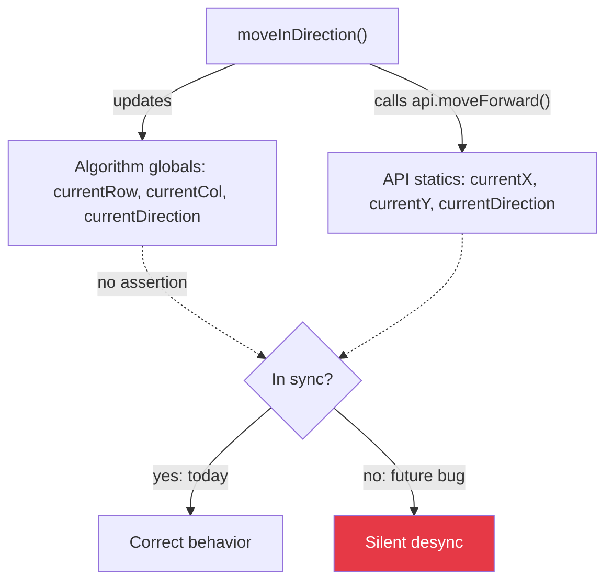

[Home](../index.md) › [Design Decisions](index.md) › **State Management**

# State Management: Two Books of Record

## The Decision (and Its Cost)

Pose state lives in two independent places:

| Owner | State | Updated by |
|---|---|---|
| `algorithm.cpp` globals | `currentRow`, `currentCol`, `currentDirection`, `startingRow/Col`, wall + distance matrices | Solver's own bookkeeping after each move/turn |
| `API` statics | `currentX`, `currentY`, `currentDirection` | Inside `moveForward()` / `turnRight()` / `turnLeft()` |

Both stay correct only because every motion is routed through both paths: e.g., `moveInDirection()` calls `api.moveForward()` *and* advances `currentRow/currentCol` itself. Nothing enforces the agreement — there is no assertion comparing them, so any future code path that moves one without the other desyncs silently ([RD-14](../rd-items/navigation/rd-14-duplicate-direction-state.md), [RD-21](../rd-items/code-health/rd-21-dead-position-state-in-api.md)).

## Desync Risk

Nothing enforces agreement between the two books. Any code path that updates one without the other breaks silently.

## Why It Ended Up This Way

The solver was written against the simulator convention where the API owns the world; the row/col globals were added because the algorithm needs cheap random access into `distance[][]` and the wall arrays keyed by its own coordinates, and because `API` exposes no position query.

## Direction Enum Discipline

`Direction` values are treated as integers with modular arithmetic: relative direction is computed as `(absolute - currentDirection + 4) % 4`. Turns update the global via `(currentDirection + delta) % 4`. This works as long as every turn goes through `turn(Direction, API)` — the single choke point.

## Guidance Going Forward

Either promote `API`'s pose to the single source of truth and add accessors the solver reads, or delete `API`'s hidden copy entirely. Pick one book of record before adding features like speed runs that depend on exact pose.

---

| ← Previous | Up | Next → |
|---|---|---|
| [Wall Encoding](wall-encoding.md) | [Design Decisions](index.md) | [Maze Persistence](maze-persistence.md) |
