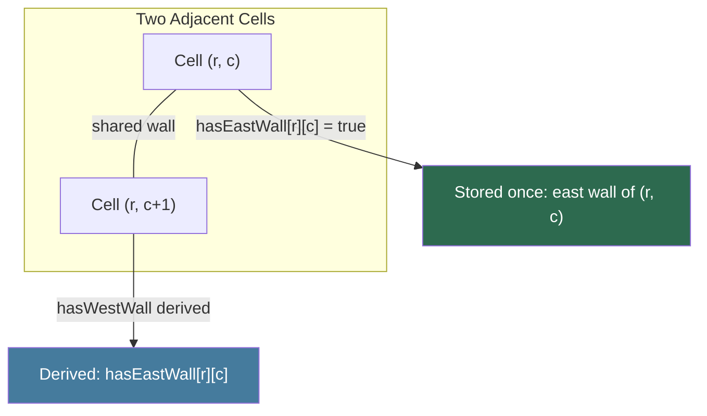

[Home](../index.md) › [Design Decisions](index.md) › **Wall Encoding: North/East Only**

# Wall Encoding: North/East Only

## Decision

Maze walls are stored in two 16×16 arrays (`algorithm.cpp`):

```cpp
bool hasNorthWall[MAZE_WIDTH][MAZE_LENGTH];
bool hasEastWall[MAZE_WIDTH][MAZE_LENGTH];
```

Only the North and East walls of each cell are ever written. South and West walls are *derived*: cell `(r, c)`'s south wall is `(r-1, c)`'s north wall, and its west wall is `(r, c-1)`'s east wall.

## Shared-Wall-Once Illustration

Two adjacent cells share one physical wall. The firmware stores it in only one of them:



The south wall of `(r, c)` is stored as `hasNorthWall[r-1][c]` — the north wall of the cell below. Every physical wall appears in exactly one array entry.

## Rationale

1. **Each physical wall is stored exactly once.** A wall between two cells would otherwise need to be kept consistent in both cells' records.
2. **Half the memory** versus a four-flag-per-cell layout — relevant on an ESP32 alongside NVS copies for persistence.
3. **Simpler persistence**: `save()` serializes exactly these two matrices plus the computed `distance` map into NVS ([Maze Persistence](maze-persistence.md)).

## Consequences

- Wall-marking code must normalize sensor observations (which are relative: front/left/right) into absolute N/E updates, touching either this cell's flags or the neighbor's.
- Any consumer asking "is there a wall to the south of `(r,c)`?" must look up `hasNorthWall[r-1][c]` — including bounds checks at maze edges.
- The solver's `isWallInDirection` handles this translation but silently returns `false` for the rear direction ([RD-10](../rd-items/navigation/rd-10-rear-wall-assumption.md)).

---

| ← Previous | Up | Next → |
|---|---|---|
| [Design Decisions](index.md) | [Design Decisions](index.md) | [State Management](state-management.md) |
