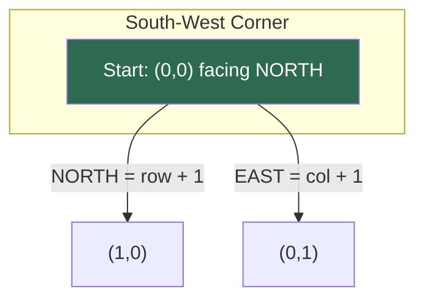
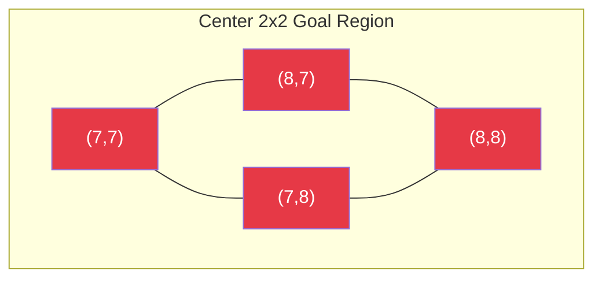
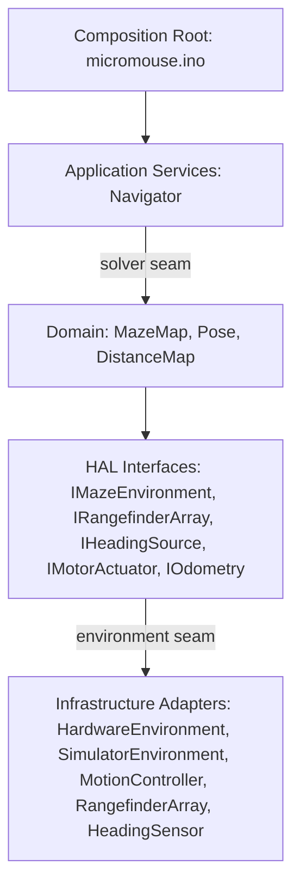
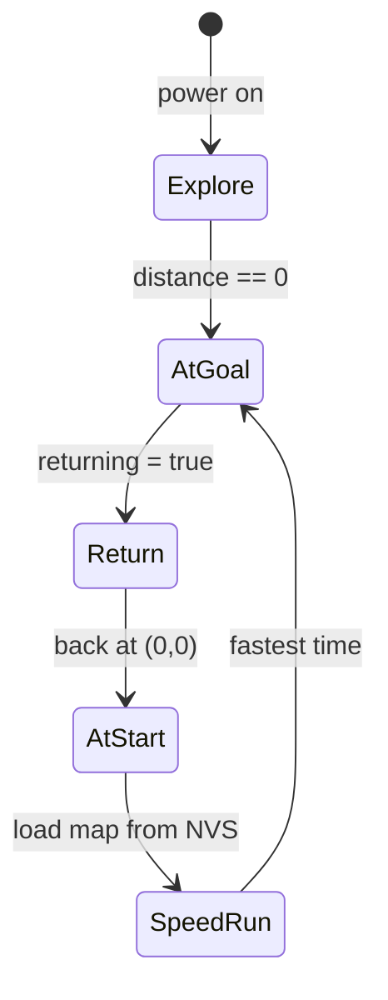

[Home](../index.md) › **Overview**

# Overview: The Problem and the Solution

## The Problem

A micromouse must autonomously solve a 16×16 maze whose walls are unknown beforehand. It starts in a corner, must reach the center 2×2 goal, mapping walls as it goes, then return to the start and re-run to the goal along the shortest known path — all within a time limit, fully autonomous after launch.

Doing that alone requires four concurrent capabilities:

1. **Sense** — detect walls on three sides (front/left/right time-of-flight rangefinders) and know its own heading (IMU yaw) and distance traveled (wheel encoders).
2. **Decide** — choose the next cell from incomplete maze knowledge, revising decisions as walls are discovered.
3. **Act** — execute precise cell-to-cell motion and 90°/180° turns with closed-loop control.
4. **Remember** — survive a mid-run reset by persisting the explored map to flash.

This firmware's concrete reality: an ESP32 driving a BNO08x attitude sensor, three VL53L0X rangefinders, and dual encoder motors, with the maze map persisted via NVS. One intended environment is real hardware; the other is the Micromouse Simulator protocol.

### The Arena

One concrete example maze (generated, consistent with the firmware's conventions). `S` marks the start `(0,0)` at the south-west corner; `G` marks the four center goal cells. North is up:

```text
┌─────┬─────────┬───────┬───────┐
│     │         │       │       │
├── │ │ ┌── ┌─┐ └─┐ ┌── │ ────┐ │
│   │ │ │   │ │   │ │   │     │ │
│ ┌─┘ └─┤ ┌─┘ └── │ └─┐ └─┬───┘ │
│ │     │ │       │   │   │     │
│ └─┬─┐ │ │ ──┬───┴── ├─┐ │ ──┐ │
│   │ │   │   │       │ │ │   │ │
│ │ │ ├───┴── ├── ┌───┘ │ │ │ │ │
│ │ │ │       │   │     │ │ │ │ │
│ │ │ │ ┌─┬───┘ ┌─┴───┐ │ └─┤ │ │
│ │ │   │ │     │     │ │   │ │ │
│ │ │ ──┤ │ │ ──┤ ┌── │ └─┐ │ └─┤
│ │ │   │   │   │ │       │ │   │
│ │ ├─┐ │ ──┴─┐ │ ├───────┤ │ │ │
│ │ │ │ │     │G│G│       │ │ │ │
├─┘ │ │ ├───┐ │ │ │ ┌───┐ │ └─┘ │
│   │ │ │   │ │G│G  │   │       │
│ ┌─┘ │ └─┐ │ │ ├───┘ │ └───┬─┐ │
│ │   │   │   │ │     │     │ │ │
│ └─┐ └─┐ └───┤ │ ┌───┼───┐ │ │ │
│   │   │     │ │ │   │   │ │ │ │
│ │ ├── ├───┐ │ │ │ │ │ │ │ │ │ │
│ │ │   │   │ │     │ │ │   │ │ │
│ │ │ ──┤ │ │ └─┬───┘ │ ├───┘ │ │
│ │ │   │ │ │   │     │ │     │ │
├─┘ ├── │ │ └─┐ ├───┐ │ └───┐ │ │
│   │   │ │   │ │   │ │     │ │ │
│ ┌─┘ ┌─┘ │ ┌─┘ │ │ └─┴──── │ │ │
│ │   │   │ │   │ │         │ │ │
│ │ │ │ ──┤ │ ──┘ ├─────────┘ │ │
│S│ │     │       │             │
└─┴─┴─────┴───────┴─────────────┘
```

The robot knows **none** of this at launch — only its own pose and what its rangefinders see from one cell. What that looks like mid-run is drawn in [Maze Exploration](../algorithms/maze-exploration.md#worked-example-one-run-seen-from-inside); the shortest path this maze hides is drawn in [A\*-Style Distance Map](../algorithms/astar-distance-map.md#the-gradient-realized-shortest-path).

### Start and Goal

The robot begins in the south-west corner facing north (`startingRow = startingCol = 0`, `algorithm.cpp:90-92`; initial heading `currentDirection = NORTH`, `algorithm.cpp:28`). The goal is the center 2×2 block — cells `(7,7)`, `(7,8)`, `(8,7)`, `(8,8)` — all seeded at distance 0 in the solver's map (`algorithm.cpp:177-180`). Reaching *any* of the four ends the explore phase.





Coordinates run `(row, col)` with row 0 on the south edge and column 0 on the west edge; the perimeter is enforced by bounds checks rather than stored walls.

**Where things stand today:** the exploration phase is functional (its defects are catalogued in [R&D Items](../rd-items/index.md)); the speed-run phase is not implemented; and switching between simulator and hardware requires editing code rather than flipping configuration.

## The Solution Shape

The target is a layered firmware with two strategy seams:



- **Infrastructure behind interfaces** — sensors, actuators, and the environment each sit behind a thin abstract interface; motion and navigation logic never touch a concrete peripheral ([RD-35](../rd-items/design-evolution/rd-35-hardware-abstraction-layer.md), [RD-36](../rd-items/design-evolution/rd-36-environment-seam-sim-real.md)).
- **Domain core without hardware dependencies** — maze map, distances, and pose are plain objects that compile and test on a host machine ([RD-37](../rd-items/design-evolution/rd-37-application-services-navigator.md)).
- **Two seams wired in one place** — solver choice (A* vs alternatives) and environment choice (sim vs real) are selected in `micromouse.ino` alone ([RD-38](../rd-items/design-evolution/rd-38-solver-strategy-seam.md)); domain naming follows the maze language, not implementation jargon ([RD-39](../rd-items/design-evolution/rd-39-domain-rename-taxonomy.md)), and dependency rules keep the layers honest ([RD-40](../rd-items/design-evolution/rd-40-layer-dependency-enforcement.md)).

The current codebase already gestures at this shape — the solver is hardware-free behind `API`/`Robot` adapters — but the adapters are singletons rather than interfaces, so neither seam can actually switch yet. That gap is exactly what the Design Evolution items close.

## Mission Phases



| Phase | Status |
|---|---|
| **Explore** — sense walls, rebuild the distance map each discovery, descend greedily, persist every step | Implemented in `floodFill()` ([Maze Exploration](../algorithms/maze-exploration.md)) |
| **Return** — flip the heuristic target back to `(0,0)` using the same machinery | Designed-for, never activated — `returning` is hardcoded false ([RD-11](../rd-items/navigation/rd-11-return-phase-unimplemented.md)) |
| **Speed Run** — reboot, reload the mapped maze from NVS, sprint the shortest path | Not implemented; NVS persistence is its foundation ([Maze Persistence](../design-decisions/maze-persistence.md)) |

## How to Read These Docs

| Section | Answers |
|---|---|
| [Architecture](../architecture/index.md) | What exists today: layers, pins, sensors, motors, API surface |
| [Design Decisions](../design-decisions/index.md) | Why it is shaped that way |
| [Algorithms](../algorithms/index.md) | How solving and motion work — including the example maze explored and solved |
| [R&D Items](../rd-items/index.md) | What needs fixing (defects) and how it should evolve (design evolution) |

---

| ← Previous | Up | Next → |
|---|---|---|
| [Home](../index.md) | **Overview** | [Architecture](../architecture/index.md) |
