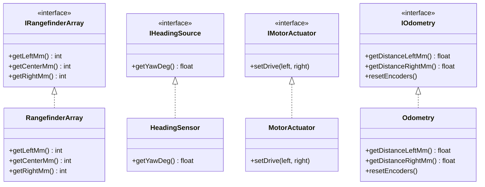

[Home](../../index.md) › [R&D Items](../../index.md) › [Design Evolution](index.md) › **RD-35**

# RD-35 — Hardware Abstraction Layer: Sensor & Actuator Interfaces

**Priority:** P1 (High) · **Status:** Open · **Area:** Design Evolution · **Source:** `Robot.h:29-31`, `Robot.cpp:47-52`, `Robot.cpp:82-186`, `motor.cpp:65-70`

## Problem

`Robot` owns concrete `TOF`, `IMU`, and `MotorDriver` instances as static members and calls them directly throughout motion, wall sensing, and the background task. There is no interface boundary, so:

- Motion and wall-sensing logic cannot be exercised without physical hardware — no offline unit tests of the code that most needs testing ([RD-01](../control/rd-01-heading-correction-disabled.md), [RD-02](../control/rd-02-turn-feedforward-prevents-settling.md)).
- No simulator or fake can substitute a sensor/actuator implementation.
- `MotorDriver` conflates actuation (`setMotors`) with odometry (`getDistanceL/R`), so those two concerns cannot vary independently.

## Evidence

```cpp
// Robot.h:29-31 — concrete types, no interfaces
static TOF tof;
static IMU imu;
static MotorDriver motor_driver;
```

```cpp
// motor.cpp:65-70 — actuation and measurement in one class
float MotorDriver::getDistanceL() {
  return (((float)getPosL() / TICKS_PER_REV) * (PI * WHEEL_DIA));
}
```

## Proposed Approach

Thin abstract interfaces per device role — plain virtual classes, no framework:

```cpp
IRangefinderArray   getLeftMm() / getCenterMm() / getRightMm()
IHeadingSource      getYawDeg()          // continuous, unwrapped
IMotorActuator      setDrive(left, right)
IOdometry           getDistanceLeftMm()/RightMm(), resetEncoders()
```

Concrete adapters (`RangefinderArray`, `HeadingSensor`, `MotorActuator`, `Odometry`) wrap the existing hardware code **unchanged** — mechanical extraction, not rewrite. The motion core holds **references to the interfaces**, injected at wiring time. A handful of vtable calls per control iteration is negligible next to millisecond-scale I²C latency; no templates or dynamic allocation needed.

This also completes the split the old `MotorDriver` prevented: command (actuator) and measurement (odometry) become independently failable, testable, and mockable.

## Target Interfaces



## Acceptance Criteria

- [ ] The four interfaces exist with no hardware includes in their headers.
- [ ] Existing TOF/IMU/motor logic moved behind the interfaces with behavior preserved.
- [ ] Actuation and odometry are independently substitutable.
- [ ] The motion layer depends only on interface references.
- [ ] Fake implementations compile in a host-side test harness (no `esp32-hal.h`, no `Adafruit_*`).

---

| ← Previous | Up | Next → |
|---|---|---|
| [Design Evolution](index.md) | [Design Evolution](index.md) | [RD-36 Environment seam sim/real](rd-36-environment-seam-sim-real.md) |
