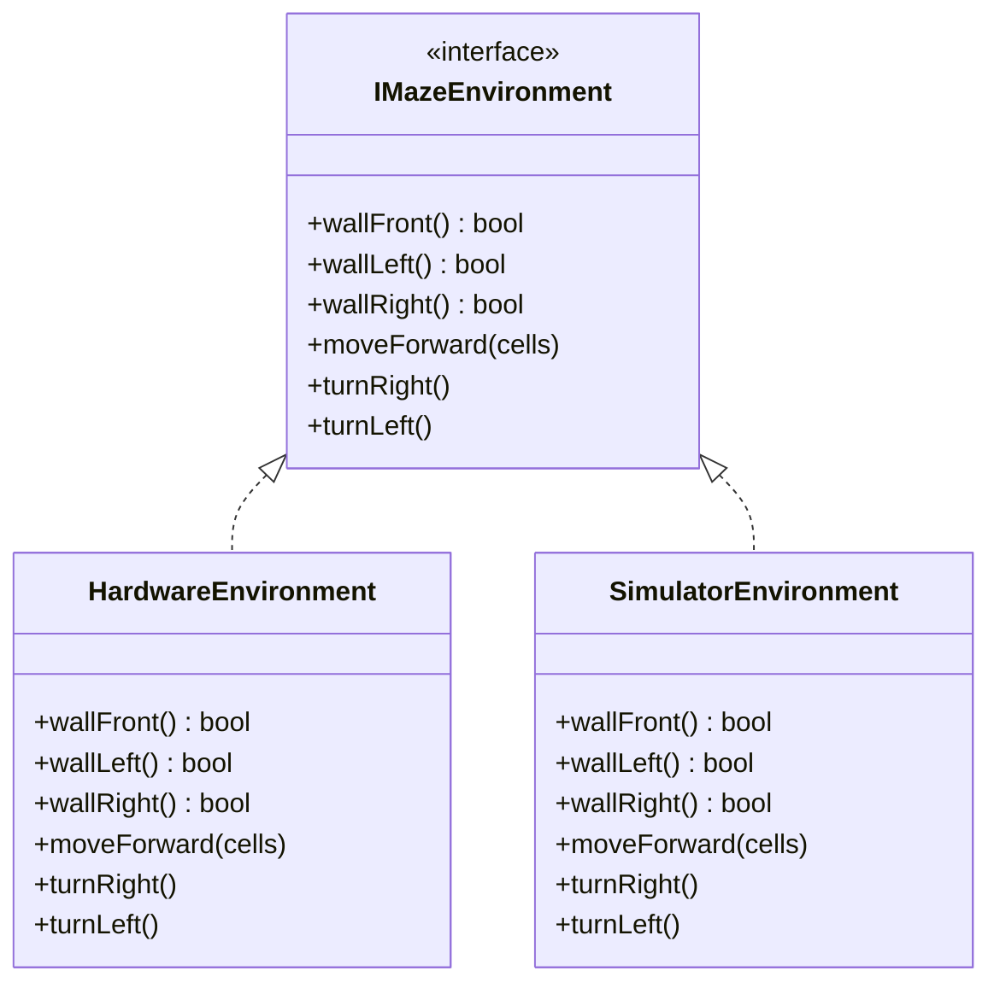

[Home](../../index.md) › [R&D Items](../../index.md) › [Design Evolution](index.md) › **RD-36**

# RD-36 — Environment Seam: Simulator ↔ Real Hardware

**Priority:** P1 (High) · **Status:** Open · **Area:** Design Evolution · **Source:** `API.h:16-52`, `algorithm.cpp:290`, `micromouse.ino:79-91`

## Problem

The solver talks to `API` — an all-static singleton wrapping the hardware path. There is no interface, so pointing the solver at a simulator instead of real hardware means editing every call site or maintaining two divergent copies of the loop. The name `API` also hides the class's actual role: a *maze-interaction environment*. Meanwhile its hidden `currentX/Y/currentDirection` state is updated but never read by the solver, which keeps its own pose globals — dead weight that can silently desync (see also [RD-14](../navigation/rd-14-duplicate-direction-state.md), [RD-21](../code-health/rd-21-dead-position-state-in-api.md)).

This is the application-level complement to [RD-35](rd-35-hardware-abstraction-layer.md): device interfaces make motion testable; the environment seam makes *navigation* runnable against either world.

## Evidence

```cpp
class API {                      // all static — cannot be substituted
private:
  static Robot robot;
  static int currentX;           // written, never read by solver
  static Direction currentDirection;
```

```cpp
void floodFill(API api) { ... }  // concrete type baked into every signature
```

## Proposed Approach

Define one seam the solver sees — the minimal Micromouse-Simulator-style surface:

```cpp
class IMazeEnvironment {
public:
  virtual bool wallFront() = 0;
  virtual bool wallLeft()  = 0;
  virtual bool wallRight() = 0;
  virtual void moveForward(int cells) = 0;
  virtual void turnRight() = 0;
  virtual void turnLeft()  = 0;
};
```

Two implementations:

- **`HardwareEnvironment`** — wall sensing via `IRangefinderArray`, motion via `MotionController` (today's `API.cpp` logic minus the dead position state).
- **`SimulatorEnvironment`** — speaks the Micromouse Simulator serial protocol.

The composition root (`micromouse.ino`) injects one `IMazeEnvironment&` into the `Navigator` ([RD-37](rd-37-application-services-navigator.md)). Sim ↔ real becomes a one-line wiring change. Position tracking moves into the domain `Pose`, eliminating the second book of record.

## Environment Seam



## Acceptance Criteria

- [ ] `IMazeEnvironment` contains only wall/move/turn methods.
- [ ] `HardwareEnvironment` and `SimulatorEnvironment` both implement it.
- [ ] The navigator depends on `IMazeEnvironment&` only.
- [ ] Sim mode compiles and runs against a stub simulator on the host — no ESP32 needed.
- [ ] Dead position state removed from the old `API`.

---

| ← Previous | Up | Next → |
|---|---|---|
| [Design Evolution](index.md) | [Design Evolution](index.md) | [RD-37 Application services layer](rd-37-application-services-navigator.md) |
