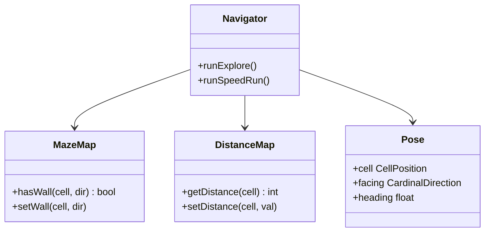

[Home](../../index.md) › [R&D Items](../../index.md) › [Design Evolution](index.md) › **RD-37**

# RD-37 — Application Services Layer: Navigator + Domain Model

**Priority:** P2 (Medium) · **Status:** Open · **Area:** Design Evolution · **Source:** `algorithm.cpp:28-33`, `algorithm.cpp:90-98`, `algorithm.cpp:290-347`

## Problem

The entire application tier is file-scope globals mutated by free functions: maze knowledge (`hasNorthWall`/`hasEastWall`/`distance`), pose (`currentRow`/`currentCol`/`currentDirection`), and a monolithic 58-line solve loop that interleaves wall mapping, distance recomputation, stepping, and NVS persistence. Consequences:

- Any function can mutate any state — and indeed two sources of truth for heading exist ([RD-14](../navigation/rd-14-duplicate-direction-state.md)).
- Nothing is instantiable, so the solver cannot be unit-tested or run twice in one process.
- The explore and speed-run phases cannot share infrastructure because there is no object to hang two phases on.

## Evidence

```cpp
Direction currentDirection = NORTH;                 // globals...
uint8_t distance[MAZE_LENGTH][MAZE_WIDTH];
bool hasNorthWall[MAZE_LENGTH][MAZE_WIDTH];
uint8_t currentRow = 0, currentCol = 0;
...
void floodFill(API api) {                           // ...and one monolith
  bool returning = false;   // speed-run phase absent
```

## Proposed Approach

Promote the globals into domain objects and one orchestration service:

| New class | Owns | Replaces |
|---|---|---|
| `MazeMap` | wall knowledge; `hasWall(cell, dir)` / `setWall(cell, dir)`; serializable | wall array globals + `isWallInDirection` |
| `DistanceMap` | cost-to-target field computed by a solver | `distance` global |
| `Pose` | `CellPosition cell`, `CardinalDirection facing`, continuous heading | row/col/direction globals |
| `Navigator` | orchestration service: sense → update map → ask solver → move → persist | `floodFill` + helpers |

The navigator holds references to `IMazeEnvironment` ([RD-36](rd-36-environment-seam-sim-real.md)), `IMazeSolver` ([RD-38](rd-38-solver-strategy-seam.md)), `MazeMap`, `Pose`, and the map store. Explore and speed-run become two methods sharing one sense/step engine: `runExplore()` and `runSpeedRun()`. This separates *what we know* (domain objects) from *what we do* (the service).

## Domain Model and Navigator



## Acceptance Criteria

- [ ] `MazeMap`, `DistanceMap`, `Pose` encapsulate the former globals.
- [ ] No file-scope mutable globals remain in the navigation layer.
- [ ] Single source of truth for heading (`Pose::facing`).
- [ ] `runExplore()` and `runSpeedRun()` are distinct callable methods (speed-run may start as a stub).
- [ ] Domain objects compile on a host with no Arduino includes.

---

| ← Previous | Up | Next → |
|---|---|---|
| [RD-36 Environment seam sim/real](rd-36-environment-seam-sim-real.md) | [Design Evolution](index.md) | [RD-38 Solver strategy seam](rd-38-solver-strategy-seam.md) |
