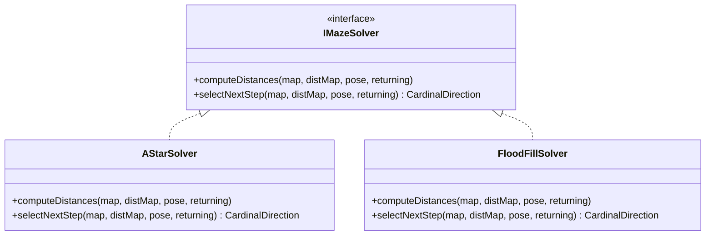

[Home](../../index.md) › [R&D Items](../../index.md) › [Design Evolution](index.md) › **RD-38**

# RD-38 — Algorithm Strategy Seam: Pluggable Maze Solver

**Priority:** P2 (Medium) · **Status:** Open · **Area:** Design Evolution · **Source:** `algorithm.cpp:161-253`, `algorithm.cpp:255-281`, `algorithm.cpp:292,324`

## Problem

Distance computation (`updateDistancesAStar`) and next-step selection (`getNextMovement`) are free functions called directly by name inside the solve loop. Trying a different decision policy — plain flood-fill, BFS, a greedy heuristic for testing — means editing the loop and recompiling. There is no common interface, so solvers cannot be swapped, compared on the same maze, or unit-tested in isolation.

## Evidence

```cpp
updateDistancesAStar(returning, api);                    // hard-wired by name
...
Direction nextDirection = getNextMovement(currentRow, currentCol, returning, api);
```

## Proposed Approach

Classic Strategy pattern — one interface, implementations behind it:

```cpp
class IMazeSolver {
public:
  virtual void computeDistances(MazeMap&, DistanceMap&, const Pose&, bool returning) = 0;
  virtual CardinalDirection selectNextStep(MazeMap&, DistanceMap&, const Pose&, bool returning) = 0;
};
```

- **`AStarSolver`** wraps the existing logic unchanged and is the default.
- Future `FloodFillSolver`, `BFSSolver`, or a trivial `GreedySolver` (useful as a test oracle) implement the same contract.
- The `Navigator` ([RD-37](rd-37-application-services-navigator.md)) holds an `IMazeSolver&` via injection; selection happens in the composition root — compile-time is enough (a typedef), runtime optional. No plugin machinery.

The seam also makes every solver unit-testable against a hand-built `MazeMap` with no hardware and no simulator.

## Strategy Seam



## Acceptance Criteria

- [ ] `IMazeSolver` strategy interface defined.
- [ ] `AStarSolver` implements it with behavior identical to today's pair of functions.
- [ ] Navigator depends on `IMazeSolver&`, never on `AStarSolver` concretely.
- [ ] A second solver drops in without touching navigator code.
- [ ] Solvers pass unit tests against synthetic mazes.

---

| ← Previous | Up | Next → |
|---|---|---|
| [RD-37 Application services layer](rd-37-application-services-navigator.md) | [Design Evolution](index.md) | [RD-39 Domain rename taxonomy](rd-39-domain-rename-taxonomy.md) |
