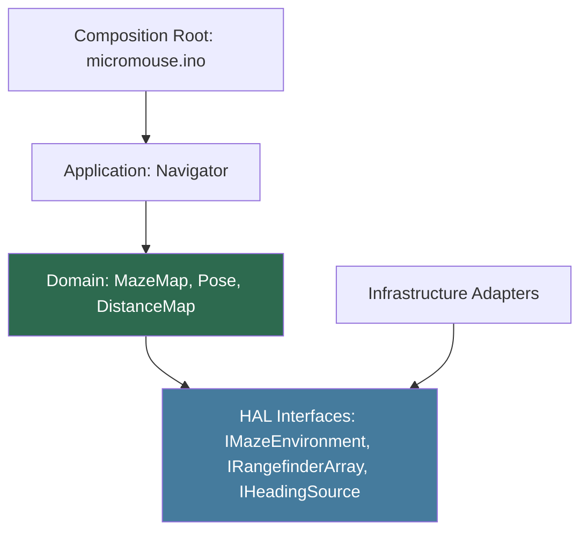

[Home](../../index.md) › [R&D Items](../../index.md) › [Design Evolution](index.md) › **RD-39**

# RD-39 — Domain-Specific Rename Taxonomy

**Priority:** P3 (Low) · **Status:** Open · **Area:** Design Evolution · **Source:** `API.h:16`, `Robot.h:13`, `Tof.h:7`, `IMU.h:8`, `motor.h:20`, `algorithm.cpp:290`

## Problem

Current names express implementation technology, not domain role — and several actively mislead:

- `API` is a generic word (application programming interface) for what is actually a maze-environment adapter.
- `Robot` suggests the whole robot, but the class is only motion control + sensor wiring.
- `TOF`/`IMU` name sensor technologies, not the roles consumers need (ranging, heading).
- `floodFill` is an algorithm name pressed into service as the application entry point.

These names collide semantically with standard usage and make the target layering ([RD-35](rd-35-hardware-abstraction-layer.md)–[RD-38](rd-38-solver-strategy-seam.md)) hard to discuss precisely.

## Proposed Approach

Apply this table in a single mechanical pass **after** RD-35..RD-38 land — renaming first would churn against a structure about to move:

| Current | Proposed | Why |
|---|---|---|
| `API` class | `IMazeEnvironment` + `HardwareEnvironment`/`SimulatorEnvironment` | Names the seam, not the mechanism |
| `Robot` | `MotionController` | It controls motion; it is not "the robot" |
| `TOF` | `RangefinderArray` (`IRangefinderArray`) | Role over technology |
| `IMU` | `HeadingSensor` (`IHeadingSource`) | Consumers want heading, not an IMU |
| `MotorDriver` | `MotorActuator` + `Odometry` | Command vs measurement split ([RD-35](rd-35-hardware-abstraction-layer.md)) |
| `floodFill()` | `Navigator::runExplore()` | Phase entry point, not an algorithm name |
| `updateDistancesAStar()` / `getNextMovement()` | `AStarSolver::computeDistances()` / `selectNextStep()` | Strategy methods behind `IMazeSolver` |
| `heuristic()` | `manhattanHeuristic()` | Names the actual heuristic |
| `isWallInDirection()` | `MazeMap::hasWall(cell, dir)` | Wall query belongs to the map model |
| `save()/loadMatrix()/eraseMatrix()` | `MazeMapStore::save()/load()/erase()` | Persistence as a named service |
| `Direction` enum | `CardinalDirection` | Reserves "heading" for the continuous angle |
| `currentRow/Col/Direction` globals | `Pose::cell` / `Pose::facing` | Pose is state of the mouse, not loose globals |
| `micromouse.ino` | keep filename (Arduino requirement) but thin composition root | Wiring only |

**Collision rules** (violating these recreates today's confusion): `Navigator` *uses* an `IMazeSolver` — never swap those two names. `MotionController` (PID level) stays distinct from `MotorActuator` (raw command). `HeadingSensor` (device) stays distinct from `Pose` (derived state), and `CardinalDirection` (discrete N/E/S/W) stays distinct from continuous heading degrees. Live environment queries (`wallFront()`) stay distinct from stored knowledge (`hasWall()`).

## Dependency Direction

Arrows point inward. Infrastructure implements interfaces; domain never touches hardware.

## Acceptance Criteria

- [ ] No class named `API`; no motion class named `Robot`; no entry function named `floodFill`.
- [ ] Rename table applied consistently across headers, sources, guards, includes.
- [ ] Sketch remains a thin composition root.
- [ ] Full build passes after the single rename commit.

---

| ← Previous | Up | Next → |
|---|---|---|
| [RD-38 Solver strategy seam](rd-38-solver-strategy-seam.md) | [Design Evolution](index.md) | [RD-40 Layer dependency enforcement](rd-40-layer-dependency-enforcement.md) |
