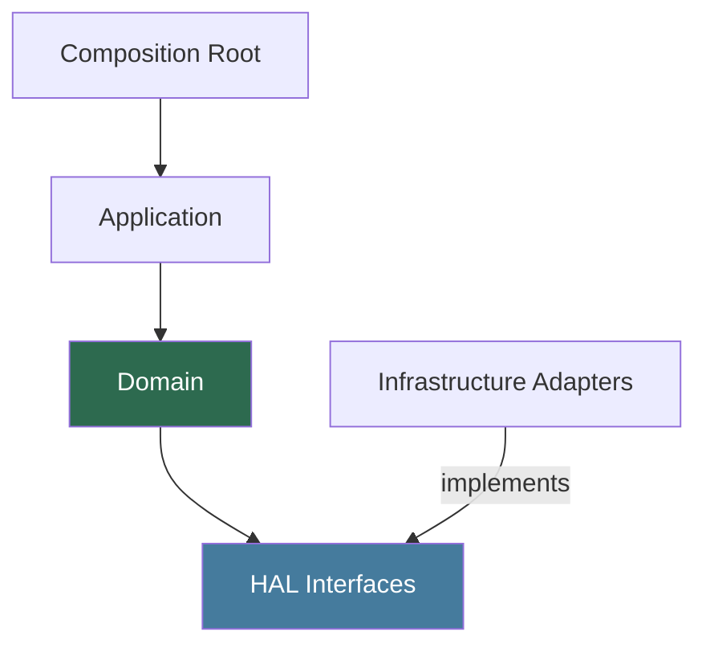

[Home](../../index.md) › [R&D Items](../../index.md) › [Design Evolution](index.md) › **RD-40**

# RD-40 — Layer Dependency Enforcement

**Priority:** P3 (Low) · **Status:** Open · **Area:** Design Evolution · **Source:** `algorithm.cpp:1-10`, `API.cpp:2`, `Robot.cpp:1-4`

## Problem

Today every layer includes everything: the algorithm includes Arduino and NVS directly, the "interface" class includes hardware, and nothing records which direction dependencies are allowed to flow. Once the layers from [RD-35](rd-35-hardware-abstraction-layer.md)–[RD-37](rd-37-application-services-navigator.md) exist, an unguarded rule will rot back to this state within a few refactors — one stray `#include <Adafruit_BNO08x.h>` in the domain and host-side testing dies again.

## Evidence

```cpp
// algorithm.cpp:1-10 — solver pulls Arduino-era headers directly
#include "API.h"
#include "algorithm.h"
#include <Preferences.h>     // NVS inside the solver layer
```

## Proposed Approach

One dependency rule, enforced cheaply:



Arrows point inward. Domain and HAL headers must not include `Adafruit_*`, `esp32-hal.h`, or `Preferences.h`.

- Domain/application headers must not include `Adafruit_*`, `esp32-hal.h`, or `Preferences.h`.
- Infrastructure must not include application/domain headers.
- Enforce with a grep check wired into CI or pre-commit:

```bash
grep -rE "Adafruit_|esp32-hal|Preferences\.h" src/domain src/application && exit 1
```

No build-system machinery needed — appropriate for an Arduino project, and enough to make violations visible at review time.

## Acceptance Criteria

- [ ] Dependency rule documented next to the architecture diagram.
- [ ] Domain/application headers pass the forbidden-includes grep.
- [ ] Check script exists, is documented, runs on every push, and passes on main.

---

| ← Previous | Up | Next → |
|---|---|---|
| [RD-39 Domain rename taxonomy](rd-39-domain-rename-taxonomy.md) | [Design Evolution](index.md) | [Home — end of tour](../../index.md) |
