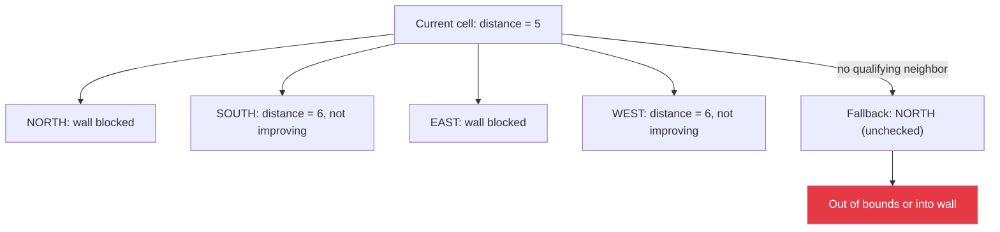

[Home](../../index.md) › [R&D Items](../../index.md) › [Navigation](index.md) › **RD-05**

# RD-05 — Solver Falls Back to NORTH and Can Leave the Maze

**Priority:** P1 (High) · **Status:** Open · **Area:** Navigation · **Source:** `algorithm.cpp:255-281`

## Problem

`getNextMovement()` initializes its answer to NORTH and only overwrites it when a qualifying neighbor is found:

```cpp
Direction bestDirection = NORTH;                       // line 257
...
if (inBounds && !wall && distance[neighbor] <= minDistance) {
  bestDirection = ...;
}
// returns bestDirection unconditionally
```

If the mouse reaches a cell where *no* neighbor satisfies the condition — locally trapped, or all better neighbors walled — the function returns NORTH with no bounds or wall validation. The caller then moves north and increments `currentRow`, which can index `distance[16][...]` (out of bounds on the 16×16 array) and physically drives the robot into whatever is north. The `<=` comparison additionally allows sideways steps to equal-distance cells, which can produce oscillation between two cells.

## Trapped-Cell Scenario



When no neighbor has a strictly smaller distance value, `getNextMovement` returns NORTH by default — with no bounds check or wall validation.

## Proposed Approach

Track whether any strictly-improving neighbor was found; return an explicit "no move" signal otherwise:

```cpp
uint8_t minDistance = distance[currentRow][currentCol];
bool found = false;
for each valid open neighbor:
  if (distance[n] < minDistance) { bestDirection = n; found = true; break; }
if (!found) return Direction::STUCK;   // caller halts safely
```

`floodFill` must handle the sentinel by stopping safely rather than stepping.

## Acceptance Criteria

- [ ] Exhaustive sim sweep: solver never indexes row/col outside 0..15.
- [ ] Trapped-cell scenario terminates with a logged halt instead of driving.
- [ ] Strict `<` comparison: no back-and-forth oscillation between equal-distance cells.

---

| ← Previous | Up | Next → |
|---|---|---|
| [Navigation](index.md) | [Navigation](index.md) | [RD-10 Rear wall assumption](rd-10-rear-wall-assumption.md) |
