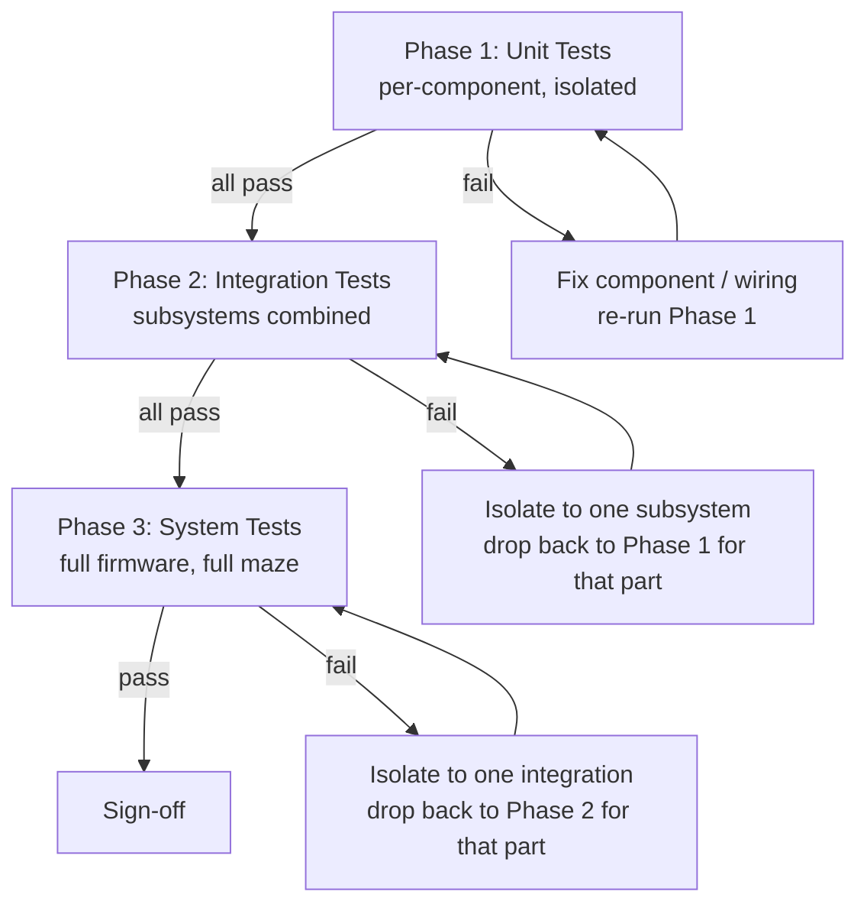

# Micromouse Hardware Test Flow

Bring-up and verification flow for the firmware in this repo (`Robot.cpp/.h`, `Tof.cpp/.h`, `IMU.cpp/.h`, `motor.cpp/.h`, `algorithm.cpp/.h`, `API.cpp/.h`), on the ESP32 platform described in [docs/architecture/hardware-platform.md](../docs/architecture/hardware-platform.md).

Three gated phases, in order: **Unit → Integration → System**. Do not start a phase until every test in the previous phase passes. If a phase fails, drop back to the phase below it to isolate the fault before retrying.



## Prerequisites

- [ ] Robot on a stand / blocks with wheels off the ground for every test until Phase 3 (Phase 2 "drift calibration" and "turn" tests drive the wheels at speed — see caveats below).
- [ ] Serial monitor at 115200 baud.
- [ ] USB power or charged battery with a multimeter on hand to check voltage sag under load.
- [ ] A physical maze cell (18 cm, `CELL_SIZE` in `Robot.cpp:13`) or taped-out equivalent for distance checks.
- [ ] Known open issues below are **expected behavior of the current firmware**, not new bugs — don't burn time re-diagnosing them:
  - Heading correction inside `move()` is multiplied by zero (`Robot.cpp:132-133`) — the robot will **not** correct yaw while driving straight; drift is expected and must be re-aligned by the next `turn()`/`snapToCardinal()` call. ([RD-01](../docs/rd-items/control/rd-01-heading-correction-disabled.md))
  - `calibrateDriftFactor()` drives both motors at PWM 255 (max) for 5 seconds with no abort condition. **Never run this with wheels on the ground.** ([RD-07](../docs/rd-items/control/rd-07-full-speed-drift-calibration.md))
  - The measured drift factor is never saved or applied anywhere — `calibrateDriftFactor()`'s result and `getDriftFactor()` are stubs. Treat this test as "does the measurement work," not "does the robot correct drift." ([RD-24](../docs/rd-items/code-health/rd-24-stubbed-drift-calibration.md))
  - The mode switch (`GPIO 23`) loads the saved maze when the switch reads HIGH — i.e. **not pressed**, since it's wired `INPUT_PULLUP`. Confirm this is the convention you want before wiring a physical switch. ([RD-19](../docs/rd-items/reliability/rd-19-mode-switch-polarity.md))
  - A ToF reading of `0` (before the first successful sample) reads as "wall detected." Power up and let the sensor task run at least one loop before trusting wall checks. ([RD-12](../docs/rd-items/sensing/rd-12-zero-distance-read-as-wall.md))

---

## Phase 1 — Unit Tests (component-level, isolated)

Goal: every sensor/actuator works correctly on its own, talking directly to test code — not through `Robot`, not through the maze solver. Flash minimal test sketches that exercise one component at a time.

### 1.1 Power & MCU bring-up

| # | Test | Pass criteria |
|---|---|---|
| 1.1.1 | Power on ESP32 from USB | Board boots, serial monitor shows output at 115200 baud |
| 1.1.2 | Power on from battery | Same boot behavior; measure battery voltage under no load |
| 1.1.3 | Brown-out check | No resets/reboots when motors are commanded to spin (see 1.3) while on battery |

Runnable sketches for these components live alongside this doc: [tof_test/](tof_test/tof_test.ino), [motor_test/](motor_test/motor_test.ino), [imu_test/](imu_test/imu_test.ino), [switch_led_test/](switch_led_test/switch_led_test.ino). Each symlinks the real driver source (`Tof.h/.cpp`, `motor.h/.cpp`, `IMU.h/.cpp`) into its own folder so it's testing actual production code, and each header-comments its own wiring. Compile/flash with `arduino-cli` (see the toolchain notes at the end of this doc) — flashing any of them temporarily replaces `micromouse.ino` on the board; reflash the main firmware afterward.

### 1.2 Encoders (`motor.cpp`, `ENCAL/ENCBL` = GPIO 39/36, `ENCAR/ENCBR` = GPIO 34/35)

| # | Test | Pass criteria |
|---|---|---|
| 1.2.1 | Manually rotate left wheel one full turn by hand | `getPosL()` reads ~60 ticks (`TICKS_PER_REV = 60`, `motor.cpp:6`) |
| 1.2.2 | Manually rotate right wheel one full turn by hand | `getPosR()` reads ~60 ticks |
| 1.2.3 | Rotate wheel forward vs. backward | Tick count direction matches (sign flips), no double-counting or missed edges at slow rotation |
| 1.2.4 | `resetEncoderL()` / `resetEncoderR()` | Count returns to 0 immediately after reset |
| 1.2.5 | `getDistanceL()` / `getDistanceR()` after one full manual turn | ≈ `π × 4 cm` (`WHEEL_DIA = 4`, one wheel circumference) within measurement tolerance |

### 1.3 Motors + H-bridge (`IN1L/IN2L/speedL` = GPIO 33/25/32, `IN1R/IN2R/speedR` = GPIO 27/26/14)

**Wheels off the ground for all of these.**

| # | Test | Pass criteria |
|---|---|---|
| 1.3.1 | `setMotors(50, 0)` | Left wheel spins forward, right wheel stationary |
| 1.3.2 | `setMotors(0, 50)` | Right wheel spins forward, left wheel stationary |
| 1.3.3 | `setMotors(-50, -50)` | Both wheels spin in reverse |
| 1.3.4 | `setMotors(50, -50)` | Wheels spin in opposite directions (in-place turn direction) |
| 1.3.5 | `setMotors(0, 0)` | Both wheels stop immediately, no coasting/jitter |
| 1.3.6 | Sweep PWM from 0 → 255 on one motor | Monotonic speed increase, no stalling/cogging at low PWM, no audible relay/H-bridge fault |

### 1.4 ToF sensors (`Tof.cpp`, VL53L0X × 3 on shared I2C, re-addressed via XSHUT)

| # | Test | Pass criteria |
|---|---|---|
| 1.4.1 | `TOF::begin()` / `setID()` | All three sensors initialize without hang; confirm each answers at its assigned address (Right `0x30`, Center `0x31`, Left `0x32`) |
| 1.4.2 | `getTofCenter()` with hand at 5 cm, 10 cm, 30 cm, open (>50 cm) | Reported mm distance tracks hand position within sensor spec (~±5%); matches `THRESHOLD_FRONT = 70 mm` boundary behavior |
| 1.4.3 | `getTofLeft()` / `getTofRight()` same sweep | Same accuracy independently on each sensor; matches `THRESHOLD_SIDE = 170 mm` boundary behavior |
| 1.4.4 | Cross-talk check: obstruct only the center sensor | Left/Right readings unaffected (rules out I2C address bleed or optical crosstalk) |
| 1.4.5 | Check `RangeStatus` per reading | Confirm what status codes come back at typical distances — current firmware accepts anything `!= 4` as valid, so note any noisy/erroneous statuses observed ([RD-13](../docs/rd-items/sensing/rd-13-invalid-range-statuses.md)) |
| 1.4.6 | Cold read before first `updateReadings()` call | Confirm cache defaults to 0 (reads as "wall present") until first sample — expected, not a fault ([RD-12](../docs/rd-items/sensing/rd-12-zero-distance-read-as-wall.md)) |

### 1.5 IMU (`IMU.cpp`, BNO08x on I2C, address `0x4B`)

| # | Test | Pass criteria |
|---|---|---|
| 1.5.1 | `IMU::begin()` | Returns `true`; no hang (if it fails, firmware halts in `Robot::begin()` — see [RD-15](../docs/rd-items/reliability/rd-15-hang-on-init-failure.md)) |
| 1.5.2 | Let robot sit still for 5 s after boot (yaw-offset calibration window) | `getYaw()` reads ≈0° once calibration window ends |
| 1.5.3 | Rotate robot flat by hand: 90°, 180°, 270°, 360° | `getYaw()` tracks rotation within a few degrees; no wraparound glitches at ±180° |
| 1.5.4 | Tilt robot (pitch/roll) | `getPitch()` / `getRoll()` respond in the expected direction/magnitude |
| 1.5.5 | Leave robot stationary for 60 s | Yaw does not drift significantly (bias/noise check) |

### 1.6 Mode switch & LED

| # | Test | Pass criteria |
|---|---|---|
| 1.6.1 | Read `GPIO 23` with switch open vs. closed | `digitalRead()` reads HIGH open / LOW closed (pull-up); confirm which physical position you want to call "load saved maze" — remember polarity is inverted from the naive reading ([RD-19](../docs/rd-items/reliability/rd-19-mode-switch-polarity.md)) |
| 1.6.2 | Status LED (`GPIO 2`, referenced in commented sketch) | LED toggles on/off as commanded, if wired |

**Phase 1 exit criteria:** every row above passes on the bench, with each component driven directly (no dependency on any other component). Record actual readings, not just pass/fail, for anything analog (ToF mm, IMU degrees, tick counts) — you'll want the baseline numbers in Phase 2.

---

## Phase 2 — Integration Tests (subsystems combined)

Goal: components that passed individually now work together through the `Robot` class. This is where sensor fusion, closed-loop control, and cross-component timing bugs show up.

**Wheels off the ground for 2.1–2.3.** Only move to wheels-on-ground for 2.4 onward, in open space with room to roll.

Runnable sketch: [integration_test/](integration_test/integration_test.ino) — symlinks `Robot.h/.cpp` (and its `Tof`/`IMU`/`motor` dependencies) into its own folder, so it drives the real `Robot::begin/move/turn/snapToCardinal/isWallFront-Left-Right`, not a reimplementation. Serial commands: `sensors`, `walls`, `move <N>`, `turn <deg>`, `snap`, `drift CONFIRM` (see the sketch header — this one runs both motors at max PWM for 5s unattended per RD-07, wheels off the ground only), `help`. A one-second heartbeat line (ToF distances + wall booleans) streams by default.

### 2.1 Sensor task concurrency (`Robot::update`, core 0 FreeRTOS task)

| # | Test | Pass criteria |
|---|---|---|
| 2.1.1 | Call `Robot::begin()` | `update()` task starts on core 0; `print_all_sensors()` shows all three ToF values updating continuously without stalling the main loop |
| 2.1.2 | Read ToF values from main loop while `update()` task is running | Values are self-consistent (no torn reads across the left/center/right mutexes), update at a reasonable rate |
| 2.1.3 | Read IMU yaw while `update()` task is running | No stale/frozen yaw, no crash from concurrent access to `imu_Mutex` |

### 2.2 Encoder + motor closed loop (odometry)

| # | Test | Pass criteria |
|---|---|---|
| 2.2.1 | `setMotors(60, 60)` for 1 s, wheels off ground | `getDistanceL()` ≈ `getDistanceR()` within a few % (matched motors) |
| 2.2.2 | `calibrateDriftFactor()` — **wheels off the ground only**, see caveat above | Returns a left/right ratio; sanity check it's close to 1.0 for a healthy drivetrain. Confirm nothing on the bench moves/falls during the 5 s full-speed run |

### 2.3 IMU-driven turning (`Robot::turn`, `Robot::snapToCardinal`)

| # | Test | Pass criteria |
|---|---|---|
| 2.3.1 | `turn(90)` | Robot yaw increases by ~90° and settles within `ERROR_TOL = 0.3°` for `REQUIRED_STABLE = 2` consecutive loops, without runaway oscillation |
| 2.3.2 | `turn(-90)`, `turn(180)` | Same settling behavior in the opposite direction and for a half-turn |
| 2.3.3 | Manually skew the robot a few degrees, then call `snapToCardinal()` | Robot rotates to the nearest multiple of 90° |
| 2.3.4 | Repeat `turn(90)` × 4 | Robot returns to (approximately) starting heading; note accumulated error, since there is no external heading truth source besides the IMU |

### 2.4 ToF-gated wall detection (`Robot::isWallFront/Left/Right`)

Wheels on ground, open floor, obstacles (maze walls or boxes) available.

| # | Test | Pass criteria |
|---|---|---|
| 2.4.1 | Place a wall in front, none on sides | `isWallFront()` → true, `isWallLeft()`/`isWallRight()` → false |
| 2.4.2 | Place walls on both sides, none in front | `isWallLeft()` and `isWallRight()` → true, `isWallFront()` → false |
| 2.4.3 | No walls anywhere in range | All three → false |
| 2.4.4 | Wall exactly at threshold boundary (70 mm front / 170 mm side) | Confirm behavior at the edge matches the `<=` comparison in `Robot.cpp:48-66` |

### 2.5 Straight-line movement (`Robot::move`)

| # | Test | Pass criteria |
|---|---|---|
| 2.5.1 | `move(1)` on open floor | Robot travels ≈1 cell (18 cm), stops (distance-PID settle or center-ToF < 40 mm cutoff), matches within a couple cm |
| 2.5.2 | `move(3)` | Travels ≈3 cells, no stall or overshoot beyond the deadzone/speed clamps |
| 2.5.3 | `move(1)` with a wall placed closer than 40 mm from center ToF mid-travel | Robot stops early (front-collision cutoff at `Robot.cpp:174`) rather than hitting the wall |
| 2.5.4 | Nudge the robot's heading by hand before calling `move()` | `snapToCardinal()` at the start of `move()` corrects heading before driving; **note that once driving starts, yaw is not corrected** — this is expected per RD-01, not a defect. Record how much the robot drifts laterally over a multi-cell `move()` so it's a known baseline |

### 2.6 Combined move + turn sequences

| # | Test | Pass criteria |
|---|---|---|
| 2.6.1 | `move(1); move(1); turn(90); move(1);` | Robot traces the expected L-shaped path; heading after `turn(90)` is correct despite any drift accumulated during the preceding `move()` calls |
| 2.6.2 | Reproduce the commented reference sequence in `micromouse.ino:14-73` (a full square-ish loop of moves/turns) | Robot completes the sequence and returns close to its start pose; log actual vs. expected end pose |

**Phase 2 exit criteria:** closed-loop motion (straight-line distance, turning, wall detection) is repeatable within documented tolerances across at least 3 repetitions of each test. Any component that fails here but passed Phase 1 in isolation points to a fusion/timing bug (mutex, PID tuning, or cross-axis coupling) — fix before moving to Phase 3.

---

## Phase 3 — System Tests (full firmware, full maze)

Goal: the actual competition firmware (`micromouse.ino` + `algorithm.cpp` + `API.cpp`) does what it's supposed to do, end to end, in a real or taped-out maze.

| # | Test | Pass criteria |
|---|---|---|
| 3.1 | Boot with mode switch in "explore" position | `loadMatrix()` is (or isn't) called per the documented convention from 1.6.1; `floodFill(api)` begins a fresh exploration |
| 3.2 | Full maze exploration run, simple maze (few dead ends) | Robot explores without getting stuck, without hitting walls, and reaches the goal cell |
| 3.3 | Full maze exploration run, maze with dead ends and loops | Flood-fill re-routes correctly on discovering new walls; robot still reaches the goal |
| 3.4 | Power-cycle after a successful exploration run, mode switch in "load saved maze" position | Saved maze loads per [RD-19](../docs/rd-items/reliability/rd-19-mode-switch-polarity.md)'s documented convention; robot uses prior knowledge instead of re-exploring from scratch |
| 3.5 | Repeat run (speed run) on the same maze | Robot completes the maze faster / more directly than the exploration run, using the already-solved matrix |
| 3.6 | Repeatability: 5 consecutive full runs, same maze, no code changes between runs | All 5 reach the goal; log any run-to-run variance (timing, path taken, any wall miss-detections) |
| 3.7 | Battery endurance | Voltage measured before/after a full run stays within a safe operating range for the motor driver and logic; note any behavior change (sluggish turns, IMU brownout) as battery drains |
| 3.8 | Fault injection: obstruct a ToF sensor mid-run (hand wave) | Robot reacts to the (possibly false) wall reading in a safe way — stops or replans, does not drive through a real wall it should have seen; cross-reference against [RD-12](../docs/rd-items/sensing/rd-12-zero-distance-read-as-wall.md) / [RD-13](../docs/rd-items/sensing/rd-13-invalid-range-statuses.md) if behavior looks wrong |
| 3.9 | Cold-boot reliability: power cycle 10× | `Robot::begin()` / `IMU::begin()` / `TOF::begin()` succeed every time; if any boot hangs, check [RD-15](../docs/rd-items/reliability/rd-15-hang-on-init-failure.md) (no timeout on sensor init failure) |

**Phase 3 exit criteria:** the robot completes the target maze reliably (define your acceptance run count, e.g. 5/5 or 8/10) within a time budget, with no unsafe collisions and no boot hangs across repeated power cycles.

---

## Test log template

Copy this table per test session:

| Date | Phase | Test # | Result (Pass/Fail) | Measured value | Notes |
|---|---|---|---|---|---|
| | | | | | |

## Sign-off

- [ ] Phase 1 (Unit) — all components pass in isolation
- [ ] Phase 2 (Integration) — closed-loop motion and sensor fusion pass, repeatable ×3
- [ ] Phase 3 (System) — full maze runs pass, repeatable per acceptance criteria

## Toolchain notes

The Arduino IDE snap on this machine bundles Python 3.6, which crashes the ESP32 core's upload tool (`SyntaxError: future feature annotations is not defined`) — the fix in place is documented inline in `flasher.py` (patched in the snap's own `~/snap/arduino/85/.arduino15/packages/esp32/hardware/esp32/3.3.11/tools/`, original backed up alongside it as `flasher.py.orig-py37`). The IDE's own Upload button should work now; if the port ever shows `No more data to read from the serial port`, close any open Serial Monitor window first (it and the upload both fight over the port) and retry.

For scripted use, `arduino-cli` (installed to `~/.local/bin`) is configured to reuse the snap's existing board packages and libraries:

```
export ARDUINO_CONFIG_FILE=~/.config/arduino-cli/arduino-cli.yaml
arduino-cli compile --fqbn esp32:esp32:esp32 --export-binaries "<sketch folder>"
arduino-cli upload  -p /dev/ttyUSB0 --fqbn esp32:esp32:esp32 "<sketch folder>"
```

`mm-compile` / `mm-upload [port]` do the same for the main `micromouse.ino` firmware specifically (defined in `~/.local/bin`, pointing at `~/Arduino_cli_sketches/micromouse`, a symlink mirror of this repo's root — arduino-cli requires the sketch folder name to match the `.ino` file name, which the repo's own folder name doesn't).
